# CCA Manager Developer Guide

- [1. Introduction](#1-introduction)
- [2. Setting up](#2-setting-up)
- [3. Design and Implementation](#3-design-and-implementation)
  * [3.1. Input Parsing](#31-input-parsing)
  * [3.2. Commands](#32-commands)
  * [3.3. Finance](#33-finance)
  * [3.4. Event](#34-event)
  * [3.5. HR](#35-hr)
- [4. Product scope](#4-product-scope)
  * [4.1. Target user profile](#41-target-user-profile)
  * [4.2. Value proposition](#42-value-proposition)
- [5. User Stories](#5-user-stories)
- [6. Non-Functional Requirements](#6-non-functional-requirements)
- [7. Glossary](#7-glossary)
- [8. Instructions for manual testing](#8-instructions-for-manual-testing)

## 1. Introduction 
CCA Manager is a revolutionary all-in-one management tool that changes the way you can manage interest groups with unrivaled efficiency and simplicity. Its lightweight Command Line Interface (CLI) allows administrators to breeze through tasks quickly and easily while offering powerful features to advanced users.

This developer guide is written to document the implementation of CCA Manager. This document is intended for people who
are interested in learning more about the technical details of the various features and the organization of the application.

## 2. Setting up
Refer to the guide here.

## 3. Design and Implementation

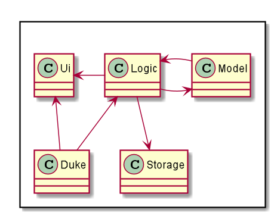

The **Architecture Design** given above explains the high-level design of the App. Given below is a quick overview of each component.

**`Duke`** is the main class of the application, and handles the app launch, initializing the appropriate classes to be used.

The rest of the app consists of the below:

* [**`UI`**] : The UI of the App.
* [**`Logic`**] : The command executor.
* [**`Model`**] : Holds the data of the App in memory.
* [**`Storage`**] : Reads data from, and writes data to, the hard disk.

### 3.1. Input Parsing
**Current Implementation**  
The `Parser` class in `seedu.duke.backend` handles most of the input parsing. The `Parser` is a standalone class. Its purpose is to handle the conversion of read Strings from the `Ui` to UserInput objects
safely for the rest of the program to handle. It implements the following operations:

* `Parser#parse()` - Converts the supplied input `String` to a `UserInput` object
* `Parser#checkCategory()` - Convert the supplied `String` to a `String` category. This function implements Shorthand category detection.
* `Parser#sanitize()` - Check for unsupported, illegal or potentially malicious input and remove it from the `String`.

Given below is an explanation on the logical flow of the `parse()` function.

1. The supplied `String` is sent to `sanitize()` to remove any potentially unwanted input that may cause undefined application behavior.
2. `sanitize()` will analyze the `String` and run a set list of checks to verify that the input is safe for the rest of the routine to handle.
3. `parse()` will split the `String` to a `String[]` to identify the number of arguments.
4. `checkCategory()` is invoked to identify if the command belongs to a specific category.
5. A `HashMap<String,String>` is created to store all the arguments supplied by the user.
6. A new `UserInput` object is created with the arguments in the HashMap, the category of the command and the command.
7. The function returns the `UserInput` to the `Ui` for further execution.

**Design Considerations**  
Aspect: Statefulness of Parser object
* Alternative 1 (Current Choice): Parser does not preserve state between parses.
    * Pros: Easy to implement. Easy to test. Promotes use of single commands over multi-step commands.
    * Cons: Unable to implement intelligent functionality where previous input influences the behavior of the next.
    * Reason for choice: Our focus for this application is simplicity and efficiency. Having stateful commands runs counter to this design philosophy.
* Alternative 2: Parser preserves stateful information
    * Pros: Able to implement multi-step commands. Can easily implement confirmation step for commands that manipulate large volume of data.
    * Cons: More complicated to implement. Harder to ensure the behaviour of the parser is consistent. Harder to debug.

Aspect: Design of parser
* Alternative 1 (Current Choice): Dedicated parser class creates an object to be passed into all other Command objects
    * Pros: Allows other classes to check for the required arguments without having to do low level string handling. Enforces consistent parsing across all commands. Enables `/` arguments to be added and read in any order.
    * Cons: Incurs additional overhead from adding an extra step between the input operation and the command invocation.
* Alternative 2: Each Command handles its own input independently
    * Pros: Command classes are free to simplify the parsing step depending on the required complexity of the command. No intermediate step and overhead.
    * Cons: More difficult to enforce parsing standards across Commands. String manipulation becomes required in every command.

### 3.2. Commands
**Current Implementation**  
The abstract `Command` class in `seedu.duke` defines how the rest of the commands interact with the UI and UserInput objects.
Its purpose is to ensure that all commands conform to the same design and coding standards to be compatable with the UI layer while also being
sufficiently flexible to allow for complex commands to be created. It specifies the following *abstract* methods:

* `Command#help()` - Allows commands to specify a default help `String` to be displayed if the argument supplied is incorrect.
* `Command#validate()` - Checks if the supplied `UserInput` was intended for this command and validates if the supplied arguments are correct. This is akin to knocking the doors of houses on a street to look for an individual.
* `Command#execute()` - Performs the command action. This is only run if `validate()` returns `ACCEPT`.

Given below is the logical flow of the `Command` input to execution flow:

1. The `Ui` reads the user input.
2. The `Ui` calls the `Parser` to parse the input
3. The `Parser` returns the `UserInput` to the `Ui`
4. The `Ui` checks through the list of available commands and runs `validate()` on each of them until one command returns either `ARGUMENT_ERR` or `ACCEPT`
    * If the `Ui` receives an `ARGUMENT_ERR`, it calls the `help()` function of that command and prints the `String` to the `Ui`.
    * If the `Ui` receives an `ACCEPT`, it proceeds with the execution flow from 5.
    * If the `Ui` receives no `ACCEPT`s or `ARGUMENT_ERR` after going through all commands, the `Ui` prints a list of available commands.
5. The `Ui` calls the `execute()` method of the command that `ACCEPT` the `UserInput`.
6. The `Ui` prints the output String returned from the `execute()` method.

**Design Considerations**    
Aspect: The need to instantiate a `Command`
* Alternative 1 (Current Choice): `Command` is instantiated on `UI` initialization.
    * Pros: Easy to implement. Less overhead from executing commands. Locality of the code allows for minimal merge conflicts when developing collaboratively.
    * Cons: Requires more memory at load to hold all the objects.
    * Reason for choice: Since we do not have a stateful parser, this option was chosen as the simplest implementation that gets the job done.
* Alternative 2: `Command`s only contain static methods
    * Pros: Conceptually more sensible than having exactly one instance of each command.
    * Cons: More complicated to implement, java has no elegant simple way to exploit inheritance and static functions in a list of classes making this option unpractical without implementing a bunch of hacks.

Aspect: `Command` resolution and validation
* Alternative 1 (Current Choice): Each class is free to specify its own matching patterns and criterion.
    * Pros: Allows for more complex criteria evaluation without having a dedicated class for resolving commands. Makes good use of abstraction and inheritance and puts all the `Command` related functions in the same class.
    * Cons: Searching of the command list is `O(n)` but the individual validation functions may not be `O(1)`, resulting in higher potential overhead if validation functions are not optimized.
    * Reason for choice: We wanted development of command related functions to all be housed in the same class. This design achieves that goal while giving us a great deal of flexibility.
* Alternative 2: Dedicated class for command resolution and validation
    * Pros: Further separates the job of command resolution from the `Ui` and `Command`. Simplifies `Command` class.
    * Cons: Would be a class which features a very un-elegant large `if-else` block or `switch` block. Requires every new command to update this class with a substantial amount of new lines. Harder to develop collaboratively, increases chances of merge conflicts.

### 3.3. Finance
**3.3.1. Add/delete finance log entry feature**  
3.3.1.1. Current Implementation  
The `CommandFinanceAdd` class in `seedu.duke.finance` handles adding finance log entry. It adds a new `FinanceLog` instance according to `userInput` into `FinanceList`.  
The `CommandFinanceDel` in the same package handles deleting finance log entry. It deletes a certain `FinanceLog` instance according to the index provided by `userInput` from `FinanceList`.  
They implement the following operations:  
* `CommandFinanceAdd#execute()` - Adds a new finance log entry into the `FinanceList` according to `userInput`.  
* `CommandFinanceDel#execute()` - Deletes a certain finance log entry from `FinanceList` according to the index provided by `userInput`.  

Given below is an example usage scenario and how the add/delete finance log entry behaves at each step.  

Step 1. The user launches the application for the first time. The `FinanceList` will be initialized with no `FinanceLog` in it.  

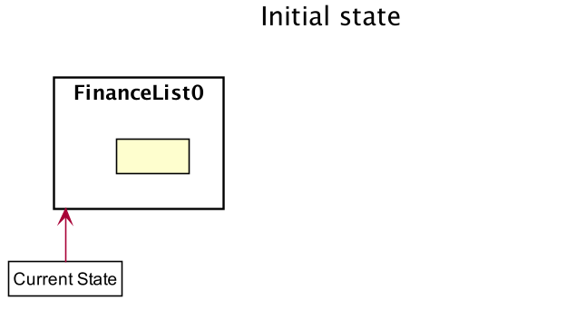

Step 2. The user executes `finance addLog iphone12 1299` command to add a finance log entry with content "iphone12" and value "1299" into finance list. The `finance addLog` command
calls `CommandFinanceAdd#execute()`, then `FinanceList` will be added a `FinanceLog` with its `finLog` as `iphone12` and its value as `1299`.  

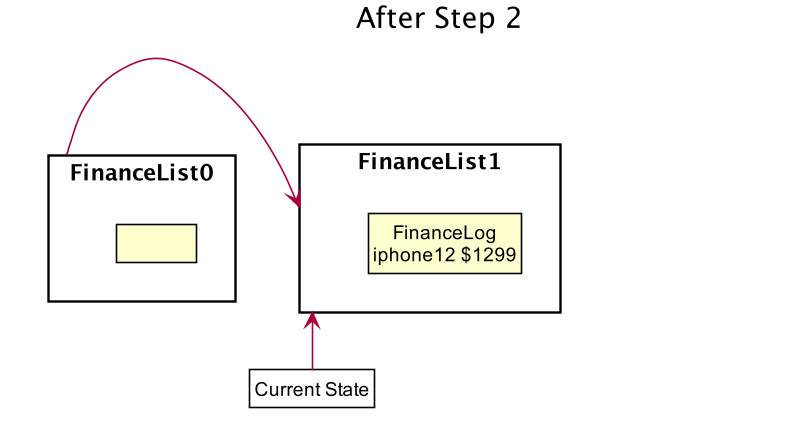

Step 3. The user executes `finance delLog 1` command to delete the 1st finance log entry in the finance list. The `finance delLog`
command calls `CommandFinanceDel#execute()`, causing the `FinanceLog` of index 1 removed from `FinanceList`.  

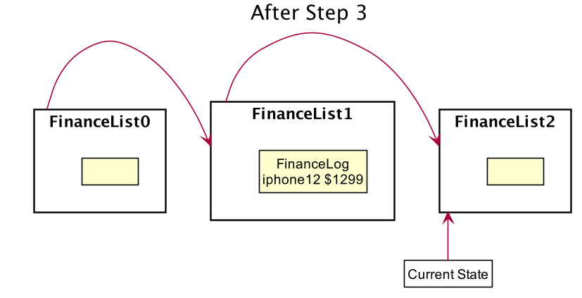

The sequence diagram for adding a finance log entry is shown below:  

  

The sequence diagram for deleting a finance log entry is shown below:  

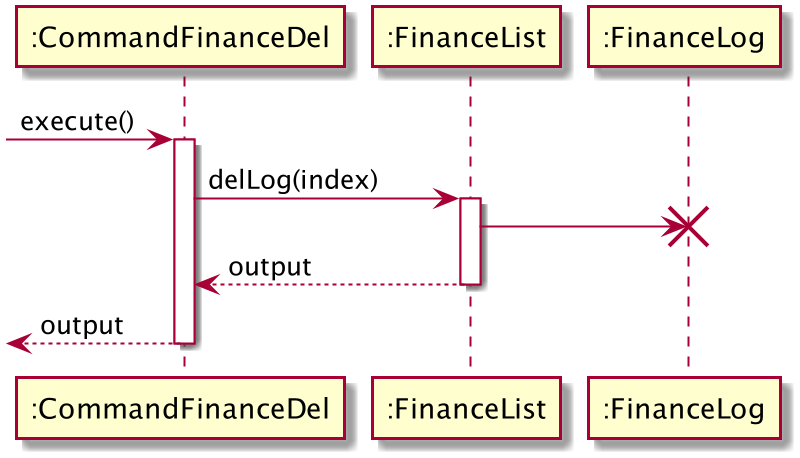  

**3.3.1.2. Design Considerations**  
Aspect: User input format for adding a finance log entry
*Alternative 1(Current Choice): The user inputs command in format of "finance addLog ITEM_NAME ITEM_VALUE".  
    *Pros: It is more convenient for the user to type commands and easier to memorize the command format.  
    *Cons: It takes longer time to execute the command for the program has to identify which part is ITEM_NAME and which part is
    ITEM_VALUE. If the user inputs a separate number for ITEM_NAME but forgets to type ITEM_VALUE, then the program will mistake 
    the separate number in ITEM_NAME for its ITEM_VALUE.  
*Alternative 2: The user inputs command in format of "finance addLog /n ITEM_VALUE /v ITEM_VALUE".  
    *Pros: The program can easily detect if the input command is valid.  
    *Cons: It is harder for the user to memorize the command format. It also costs more time when executing.  
    

**3.3.2. List the summary of finance log entries**  
3.3.2.1. Current Implementation  
The `CommandFinanceSummary` class in `seedu.duke.finance` handles listing all the finance log entries in `FinanceList` and 
showing the total budget of all the `FinanceLog`.  
It implements the following operation:  
* `CommandFinanceSummary#execute()` - Lists all `FinanceLog` in `FinanceList` and shows the total budget of them.  

Given below is an example usage scenario and how the program list the summary of finance log entries.  

Step 1. After some `finance addLog` commands, the user created a `FinanceList` with two `FinanceLog`. The first `FinanceLog` is 
"iphone12 $1299" and the second `FinanceLog` is "chicken rice $3.5".  

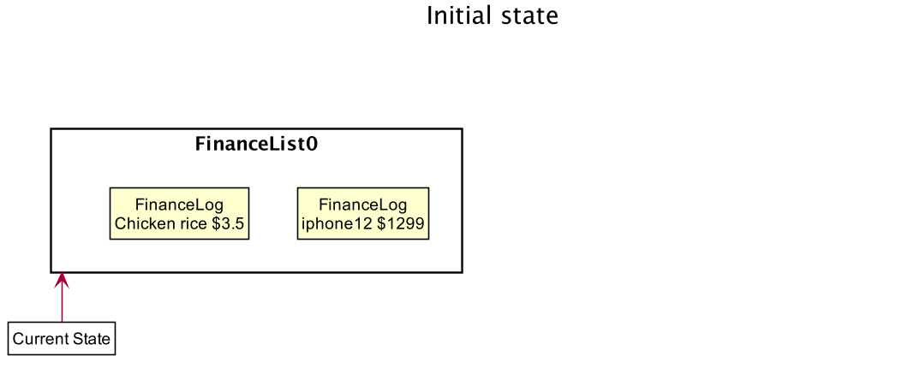

Step 2. The user executes `finance summary` command to list the summary of `FinanceList`. The `finance summary` command calls 
`CommandFinanceSummary#execute()`, then every `FinanceLog` in `FinanceList` will be output and the total budget will be printed out at the bottom. Nothing will be changed in `FinanceList`.  

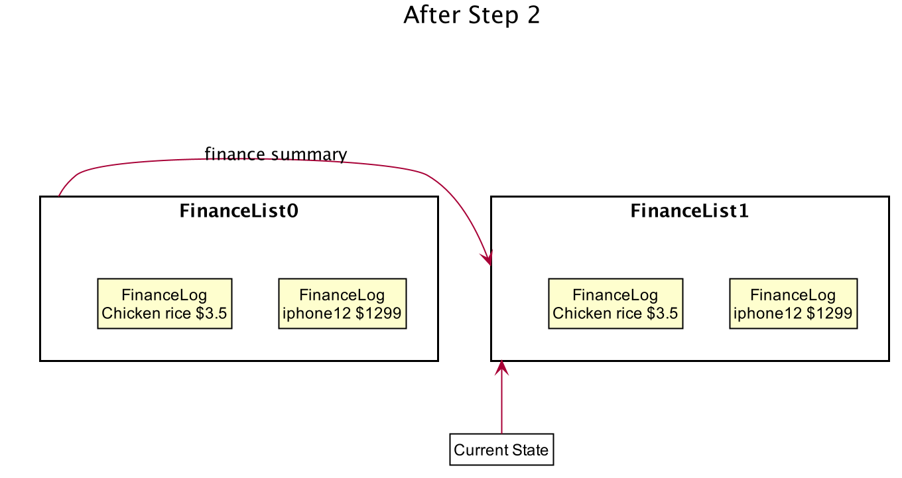  

The sequence diagram of listing summary of finance log entries is shown below:  

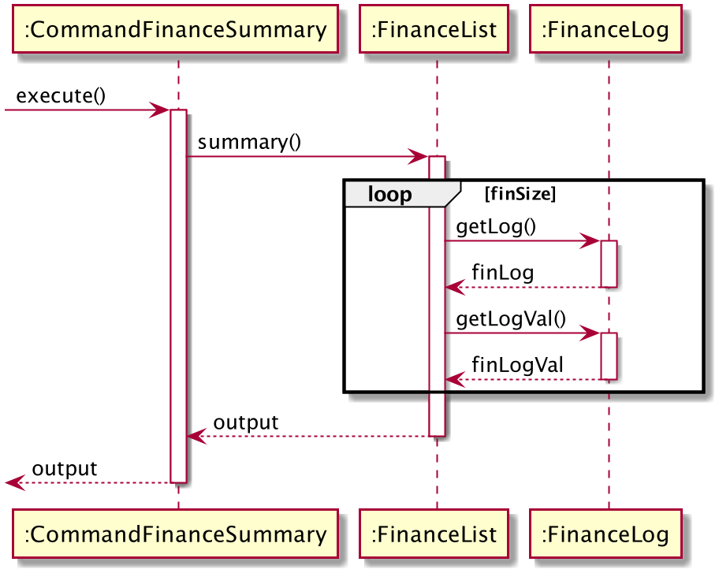  

**3.3.2.2. Design Considerations**  
Aspect: Repeated items  
*Alternative 1(Current Choice): The summary will output all the repeated items.  
    *Pros: It can display all the indexes of the repeated items so that when user wants to delete any one of them, 
    he can just refer to this summary.  
    *Cons: It cannot display the total budget for these repeated items. The user has to find a way to calculate it 
    by himself.  
*Alternative 2: The summary will combine all the repeated items then output them.  
    *Pros: The user do not have to calculate the total budget for repeated items by himself.  
    *Cons: The summary cannot show each index of the repeated items that it is confusing when user wants to delete 
    any one of them.  

### 3.4. Event
**3.4.1. Add/delete events feature** 
 
3.4.1.1. Current Implementation  
The `CommandEventAdd` class in `seedu.duke.event` handles the adding of events. According to the `userInput`, it adds a new event to the `EventList`. 
The `CommandEventDel` class in the same package handles deleting of a event. It deletes an `Event` instance according to the index provided by `userInput` from the `EventList`.  
They implement the following operations:  
* `CommandEventAdd#execute()` - Adds a new event into the `EventList` according to `userInput`.  
* `CommandEventDel#execute()` - Deletes an event from `EventList` or deletes all the events in the list. 
To delete a particular event, enter the index of the event.
To delete all the events in the list, enter `all` instead of the index of the event.

Given below is an example usage scenario and how add/delete event function behaves at each step.  

Step 1. The user launches the application for the first time.   

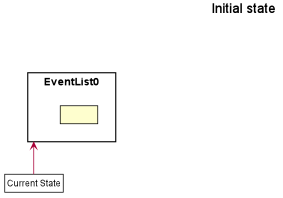

Step 2. The user executes `event addEvent /n arduino course /d 2020-12-30 /t 8pm` command to add a new event with the name "arduino course", 
the date of the event "2020-12-30" and the time "8pm" into event list. 
The `event addEvent` command calls `CommandEventAdd#execute()`, then `EventList` will add a new `Event` with event name as `iphone12`, date as `2020-12030` and time as `8pm`.  

Step 3. The user executes `event delEvent 1` command to delete the 1st event in the event list. The `event delEvent`
command calls `CommandEventDel#execute()`, causing the `Event` at index 1 to be removed from `EventList`.  

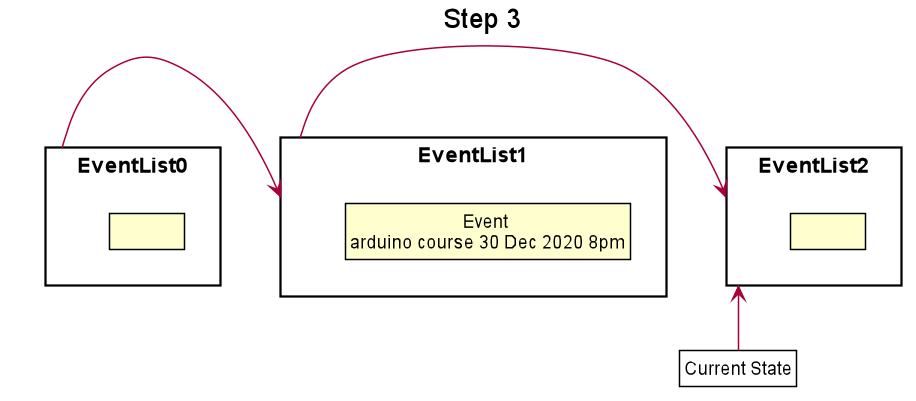

The sequence diagram for adding an event is as shown below:

The sequence diagram for deleting a particular event or all events is as shown below:

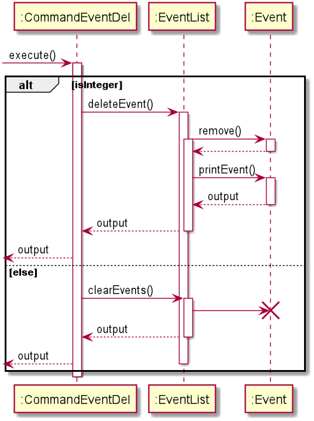

**3.5.2. Listing Events** 

3.5.2.1 Current implementation
The `CommandEventList` class in `seedu.duke.event` handles listing all the events in `EventList`.

It implements the following operation:  
* `CommandEventList#execute()` - Lists all `Event` in `EventList`.  

Given below is an example usage scenario and how the program list the events.  

Step 1. After some `Event addEvent` commands, the user has created a `EventList` with some `Event`. Assuming there are 2 events in the list.
The first `Event` has the name arduino course on 30 December 2020 at 8pm and the second `Event` has the name Autodesk course on 25 May 2021 from 10-12pm.

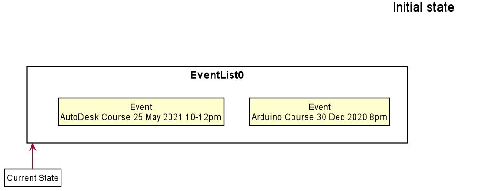

Step 2.The user executes `event listEvent` command to list the `EventList`. The `event listEvent` command calls 
`CommandEventList#execute()`, then every `Event` in `EventList` will be printed out. Nothing will be changed in `EventList`.  

The sequence diagram for listing events is as shown below:

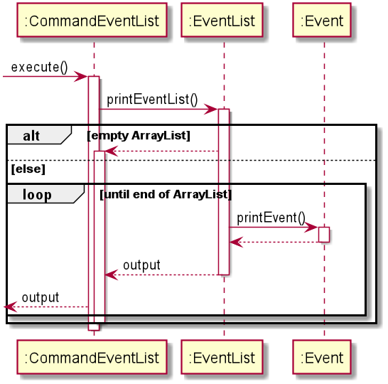

**3.4.3. Searching for an event via name or date**

Current Implementation
The `CommandSearchEvent` class in `seedu.duke.event` handles search of an event via its name or its date.

It implements the following operation:  
* `CommandSearchEvent#execute()` - Search all `Event` in `EventList` for the name or date entered by user.
 
 The sequence diagram for searching for an event is as shown below:

 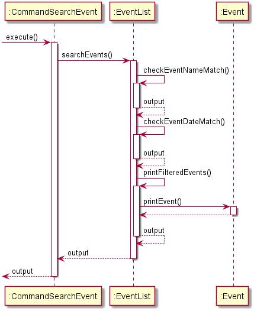
 
 
**3.4.3: Displaying countdown to upcoming events**

Current Implementation
The `CommandEventCountdown` class in `seedu.duke.event` handles displays the countdown as an additional feature in the eventlist.
 
It implements the following operation:
*`CommandEventCountdown#execute()` -  displays countdown feature for all upcoming `Event` in the `EventList`.

The sequence diagram for displaying countdown is as shown below:

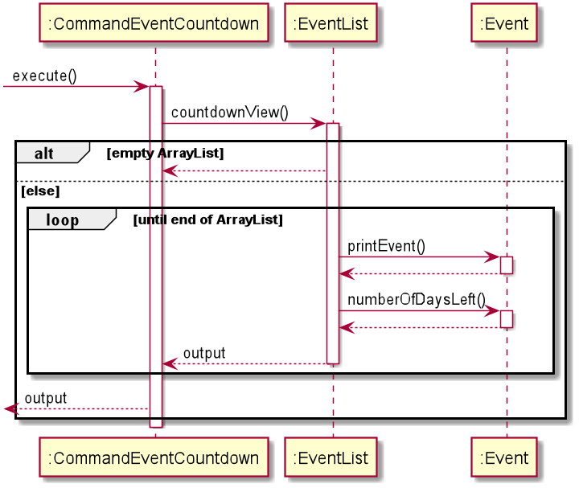

### 3.5. HR
This section describes some noteworthy details on how features under HR are implemented.  

**3.5.1. Add/delete member feature**  
3.5.1.1. Current Implementation  
The add/delete member mechanism is facilitated by `CommandAddMember` and `CommandDelMember` classes. The 
`CommandAddMember` class in `seedu.duke.hr` handles adding members. It adds a new `Member` instance according to 
`userInput` into `MemberList`.  
The `CommandDelMember` class in the same package handles deleting members. It deletes a certain `Member` instance 
according to the index provided by `userInput` from `MemberList`.  
These two classes implement the following operations:  
* `CommandAddMember#execute()` - Adds a new member into the `MemberList` according to `userInput`.  
* `CommandDelMember#execute()` - Deletes a certain member from `MemberList` according to the index provided by 
`userInput`.  

Given below is an example usage scenario and how the add/delete member behaves at each step.  

Step 1. The user launches the application for the first time. The `MemberList` will be initialized with no `Member` in 
it.  

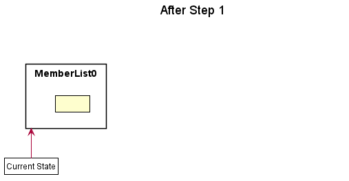

Step 2. The user executes `hr addMember /n john sterling /p 12345678 /e 123@gmail.com /r member` command to add a member
 with name "John Sterling", phone number "12345678", email "123@gmail.com" and role "member" into member list. The 
 `hr addMember` command calls `CommandAddMember#execute()`, which then calls `MemberList#findByName()`, 
 `MemberList#standardizeMemberName()` and `MemberList#addToList()`. `MemberList#findByName()` finds the `Member` in the 
 list by the given member name. `MemberList#standardizeMemberName()` standardize the member name input by the user by 
 capitalizing the first letter in each word in the name. Then, `MemberList#addToList()` adds a `Member` with its 
 `memberName` as `John Sterling`, `memberPhone` as `12345678`, `memberEmail` as `123@gmail.com`, and `memberRole` as 
 `member` into `MemberList`. 

The following shortcut commands can achieve the same result:  
`hr add /n john sterling /p 12345678 /e 123@gmail.com /r member` 
`hr a /n john sterling /p 12345678 /e 123@gmail.com /r member` 

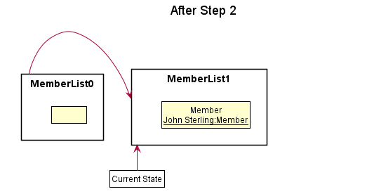

Step 3. The user executes `hr delMember 1` command to delete the member in the member list. The `hr delMember`
command calls `CommandDelMember#execute()`, causing the `Member` of index 1 removed from `MemberList`.  

**3.5.2. List the members**  
3.5.2.1. Current Implementation  
The `CommandViewMember` class in `seedu.duke.hr` handles listing all the members in `MemberList` and 
showing the contacts and role information of all the `Member`.  
It implements the following operation:  
* `CommandViewMember#execute()` - Lists all `Member` in `MemberList` and shows their contacts and roles.  

Given below is an example usage scenario and how the program list the information of members.  

Step 1. After some `hr addMember` commands, the user created a `MemberList` with two `Member`. The first `Member` is 
"John Sterling" with phone number "12345678", email "123@gmail.com", role "member" and the second `Member` is 
"Harry Potter", phone number "88888888", email "qaz@gmail.com", role "president".  

Step 2. The user executes `hr listMember` command to list the summary of `MemberList`. The `hr listMember` command calls 
`CommandViewMember#execute()`, then every `Member` in `MemberList` and the contacts and roles will be printed out within
 the same line, separated by "|". Nothing will be changed in `MemberList`.  

**3.5.3. Change member information**  
3.5.3.1. Current Implementation  
The `CommandChangeInfo` class in `seedu.duke.hr` handles changing contacts and roles information of the members in 
`MemberList` and showing the contacts and roles of the changed `Member`.  
It implements the following operation:  
* `CommandChangeInfo#execute()` - Changes any of the their contacts and roles `Member` in `MemberList` and shows the 
modified member information.  

Given below is an example usage scenario and how the program list the information of members.  

Step 1. After some `hr addMember` commands, the user created a `MemberList` with two `Member`. The first `Member` is 
"John Sterling" with phone number "12345678", email "123@gmail.com", role "member" and the second `Member` is 
"Harry Potter", phone number "88888888", email "qaz@gmail.com", role "president".

Step 2. The user executes `hr changeInfo /n john sterling /p 11111111 /r publicity director` command to change the phone
 number and role of the member with name "John Sterling" in the list. The `hr changeInfo` command calls 
`CommandChangeInfo#execute()`, then `Member` with the `memberName` `John Sterling` in the `MemberList` will have its 
`memberPhone` changed to `11111111`, and `memberRole` changed to `publicity director`. The `memberName` is not case 
sensitive. 

The following shortcut commands can achieve the same result:  
`hr c /n john Sterling /p 11111111 /r publicity director` 

**3.5.4. Design Considerations**  
Aspect: Changing member information 
*Alternative 1(Current Choice): Member information is to be modified based on the member's full name.  
    *Pros: Easy to implement. Also, if the user knows the name of the target member, which is a likely case in actual 
    practice, he can change the member's information quickly.
    *Cons: Member name cannot be easily modified. If the user wants to change the name of the member, the user has to delete 
    the target member, and add the member back using the new name.
*Alternative 2: Member Information is to be modified based on the member's index in the list.  
    *Pros: Member name can be easily modified. 
    *Cons: This feature is very dependent on the list member feature. The user will always need to call the `hr listMember` 
    command to find out the index of the target member, before he can change the member's information.  

## 4. Product scope
### 4.1. Target user profile

Our product targets people who manage interest groups and CCAs. 
However, our software solution allows us to easily expand the target audience to target schools and corporate enterprise clients in the future.

### 4.2. Value proposition

Management software is expensive and complex, training employees to use it is time-consuming. CCA Manager aims to solve these
problems by offering an all-in-one solution focused on simplicity and efficiency. 
Our use of industry standard csv format ensures compatibility with leading industry tools. 
Shorthand Commands and Relative Time allow advanced users to enter up to 70% more commands per minute. 

## 5. User Stories

|Version| As a ... | I want to ... | So that I can ...|
|--------|----------|---------------|------------------|
|v1.0|user|add/delete members to the list |keep track of the members in the CCA|
|v1.0|user|view a summary of members |view information of people in the various roles|
|v1.0|user|add/delete events to the list|so that i can manage the schedule|
|v1.0|user|view a summary of events |keep track of future and completed events|
|v1.0|user|add/delete entries|keep track of financial records in the CCA|
|v1.0|user|view financial summary |keep track of cashflow information at a glance|
|v2.0|user|view the number of days remaining for the events|remind myself of upcoming events |
|v2.0|user|perform a search on member/events|find the details of the member/event quickly|
|v2.0|user|view the list of contacts of the prof/admin|so that i know how to contact them for admin matters|
|v2.0|user|reassign member roles |so that I can update their roles and responsibilities|
|v2.0|user|change member phone numbers and emails |so that I can update their contacts|

## 6. Non-Functional Requirements

1. Should work on any mainstream OS as long as it has Java 11 or above installed.
2. Should be able to hold hundreds of thousands of data entries without losing the data.
3. A user with average typing speed should be able to accomplish most of the tasks faster using commands than using the mouse.
4. The program should support writing to a universally supported and easy to edit non-proprietary file format such as RFC 4180 .csv files.

## 7. Glossary

* *glossary item* - Definition

## 8. Instructions for manual testing

{Give instructions on how to do a manual product testing e.g., how to load sample data to be used for testing}
